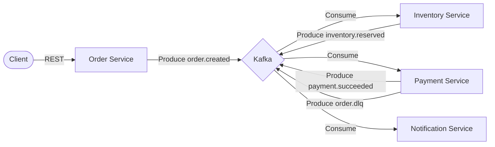

# Order Processing System
Event-driven e-commerce backend demonstration.


## Event Flow


## Overview
A distributed system consisting of four microservices communicating via Kafka. Implements reliability patterns for high-throughput order processing.

## Microservices
- Order Service: REST API for order creation.
- Inventory Service: Stock management with optimistic locking.
- Payment Service: Transaction simulation with exponential backoff and retries.
- Notification Service: Event-driven log notifications.

## Reliability Patterns
- Idempotency: UUID-based deduplication.
- Dead Letter Queue (DLQ): Failed payments routed for manual review.
- Optimistic Locking: Version-based consistency in Inventory.
- Chaos Engineering: Scripts included for simulating service and broker failures.

## Setup
1. Start services:
   ```bash
   docker-compose up --build -d
   ```
2. Test Order:
   ```bash
   curl -X POST "http://localhost:8001/orders?product_id=laptop&quantity=1&idempotency_key=unique-key-1"
   ```
3. Load Testing:
   - Script: `scripts/simulate_failures.sh load`
   - Locustfile: `load-test/locustfile.py`
